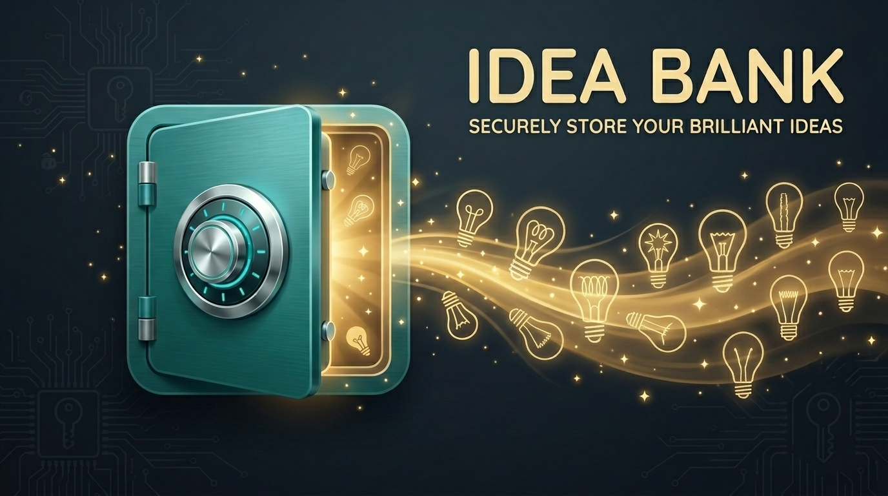
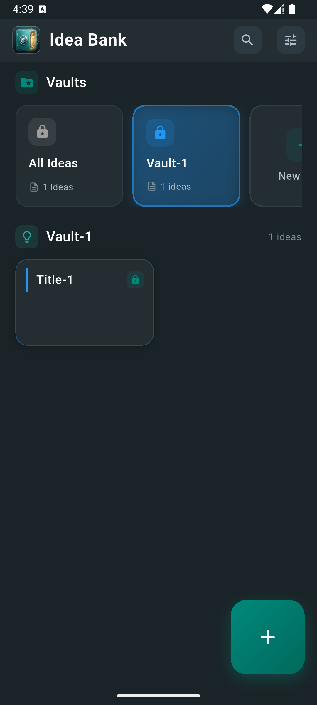
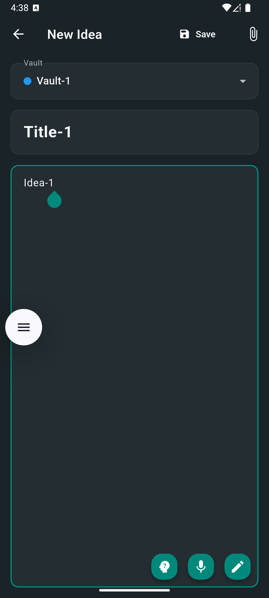
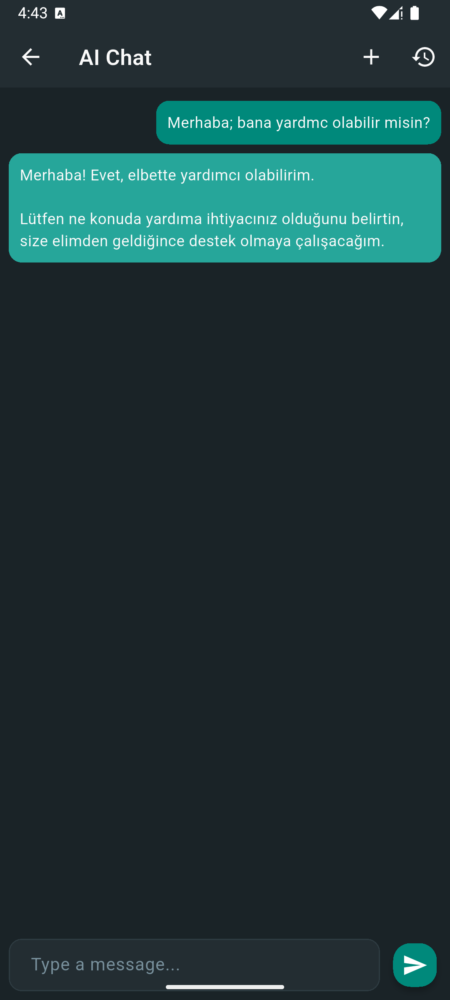

  

   
   

  # 🧠 Idea Bank

  ### *Your Ideas, Yours Alone*

  

    A secure, AI-powered note-taking app with end-to-end encryption, 
    cloud synchronization, and complete privacy control.
  

   

  

    
  

  

    
    
    
    
    
    
  

  

    <a href="#-features">Features</a> •
    <a href="#-screenshots">Screenshots</a> •
    <a href="#-download">Download</a> •
    <a href="#-security">Security</a> •
    <a href="#-tech-stack">Tech Stack</a> •
    <a href="#-license">License</a>
  

 

---

 

## ✨ Features

### 📝 Notes & Creativity
- **Rich Text Notes** — Write and organize your ideas with a clean, distraction-free editor
- **Freehand Drawing** — Sketch ideas with a smooth, pressure-sensitive drawing canvas
- **Voice Input** — Dictate your thoughts with built-in speech-to-text
- **File Attachments** — Attach documents, images, and files to any note — all encrypted

### 🤖 AI Assistant
- **Gemini Chat** — Chat with Google Gemini AI about your ideas, brainstorm, or get feedback
- **Bring Your Own Key** — Use your own API key for full control and privacy
- **Context-Aware** — AI conversations stay on your device, never shared

### 🔐 Privacy & Security
- **AES-256 Encryption** — Every note, drawing, and attachment is encrypted before it's stored
- **Zero-Knowledge Design** — Data is encrypted on your device before it ever reaches the cloud
- **Passphrase Protected** — Your encryption key is derived from your passphrase and never persisted
- **No Analytics, No Tracking** — Absolutely zero telemetry or data collection

### ☁️ Cloud Sync
- **Optional Appwrite Sync** — Sync across devices using your own self-hosted Appwrite backend
- **You Control the Server** — No shared infrastructure, no third-party access
- **Offline-First** — Everything works locally, cloud sync is entirely optional

### 📁 Organization
- **Color-Coded Folders** — Organize notes into vibrant, color-coded vaults
- **Quick Search** — Find anything instantly across all your notes
- **Trash & Recovery** — Deleted notes are kept for 7 days before permanent removal

 

---

## 📱 Screenshots

<table>
<tr>
<td align="center">

 <b>Home</b>
</td>
<td align="center">

 <b>Note Editor</b>
</td>
<td align="center">

 <b>AI Chat</b>
</td>
</tr>
</table>

 

---

## 📥 Download

  

**Installation:** Download the APK → Enable *"Install from unknown sources"* → Open & install → Done!

 

> [!NOTE]
> The pre-built APK does **not** include cloud sync. This is by design — no shared server means no one else can access your data. To enable sync, build from source with your own [Appwrite](https://appwrite.io/) credentials.

 

### 🤖 Setting Up AI Chat

To use the AI chat feature, you need a **Google Gemini API key**:

1. Visit [Google AI Studio](https://aistudio.google.com/)
2. Sign in and click **"Get API Key"** → **"Create API Key"**
3. In Idea Bank: **Settings → AI Configuration → Enter API Key**

> 🔒 Your API key is stored securely on your device and is never shared.

 

---

## 🔐 Security

Your data is protected at every layer — from creation to storage to sync.

| | What | How |
|:---:|---|---|
| 🔑 | **Encryption** | AES-256-CBC — military-grade symmetric encryption for all your content |
| 🧬 | **Key Derivation** | PBKDF2-HMAC-SHA256 with 100,000 iterations — resistant to brute-force attacks |
| 🎲 | **Unique per Operation** | Every encryption uses a random 16-byte initialization vector (IV) |
| 🔒 | **Secure Key Storage** | Master key stored in platform keychain / keystore via Flutter Secure Storage |
| 👁️‍🗨️ | **Zero-Knowledge** | All data is encrypted locally *before* it ever reaches the cloud |
| 🔄 | **Passphrase Change** | Changing your passphrase re-encrypts all existing data with a new key |
| 🧠 | **Session Only** | Your passphrase lives in memory only — it's never written to disk |

 

### 🔒 What's Encrypted?

| Data | Encrypted | Storage |
|---|:---:|---|
| Note titles & bodies | ✅ | Local + Cloud |
| Drawings & previews | ✅ | Local + Cloud |
| Chat messages | ✅ | Local only |
| File attachments | ✅ | Local + Cloud |
| Folder names | — | Local + Cloud |
| Timestamps | — | Local + Cloud |

 

---

## 🛠️ Tech Stack

| Category | Technology |
|---|---|
| **Framework** | Flutter |
| **Language** | Dart |
| **State Management** | Riverpod |
| **Database** | SQLite (sqflite) |
| **Encryption** | PointyCastle + Encrypt |
| **Cloud Backend** | Appwrite |
| **AI** | Google Gemini 3 |
| **HTTP** | Dio |
| **Drawing** | Perfect Freehand |
| **Speech** | Speech to Text |
| **Secure Storage** | Flutter Secure Storage |

 

---

## 📄 License

This project is licensed under the **Creative Commons Attribution-NonCommercial 4.0 International License (CC BY-NC 4.0)**.

- ✅ Free to use for personal purposes
- ✅ Free to modify and adapt
- ✅ Must give attribution
- ❌ Cannot be used for commercial purposes

See the [LICENSE](LICENSE) file for full details.

 

---

  **Made with ❤️ and 🔐 for privacy**

